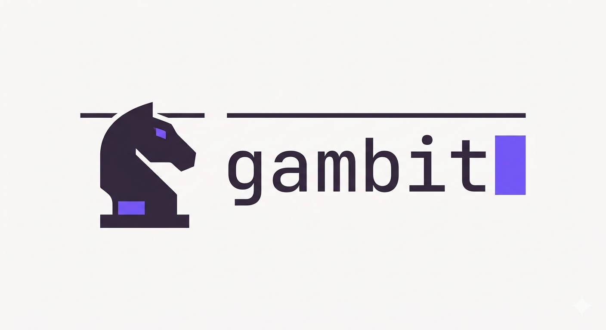

# Gambit

<p align="center">
  
</p>

A collection of skills designed to streamline product management workflows, from acceptance criteria verification to feature specification and strategic analysis.

## Overview

This repository contains reusable skills that enhance productivity across product management, requirements definition, and quality assurance teams. Each skill is standalone but designed to work together in a comprehensive product workflow.

## Skills Included

### verify-acceptance-criteria
Evaluate acceptance criteria quality against five key dimensions: clarity, testability, outcome-focus, measurability, and independence. Identifies gaps, scores severity levels, and generates improved versions of weak criteria.

### write-feature-request
Guided Feature Request (FR) authoring. Assists in writing high-quality FRs by collecting structured inputs (problem, solution, outcomes, requirements) and auto-generating Acceptance Criteria for every requirement.

### write-product-strategy
Generate comprehensive product strategy documents aligned with business goals. Helps clarify strategic direction, align teams on "where to play and how to win," and create a document that bridges vision and execution.

### sprint-review
Turn a list of completed tickets or sprint data into a polished stakeholder report. Connects directly to JIRA or GitHub when available, groups work by theme, surfaces concrete impact metrics, and outputs a clean Markdown document ready to share with leadership.

## Quick Start

```bash
# Claude plugin install (recommended)
claude plugin install github:felipecabargas/gambit
```

Or see [Installation](#installation) below for non-Claude environments.

## Directory Structure

```
.
├── README.md                          # This file
├── LICENSE                            # MIT License
├── .gitignore                         # Git ignore rules
├── skills/
│   ├── verify-acceptance-criteria/        # Quality assurance for ACs
│   ├── write-feature-request/             # Guided FR authoring
│   ├── write-product-strategy/           # Strategic planning & document generation
│   └── sprint-review/                    # Sprint recap & stakeholder reports
├── docs/
│   ├── getting-started.md            # Installation & usage guide
│   ├── skill-framework.md            # Framework & philosophy
│   └── contributing.md               # How to contribute
├── examples/
│   ├── acceptance-criteria-samples.md # Sample evaluations
│   └── [more examples coming]
└── package.json                       # NPM metadata
```

## Installation

### Claude Plugin (recommended)

```bash
claude plugin install github:felipecabargas/gambit
```

Skills are immediately available as both model-invoked skills and slash commands (`/gambit:sprint-review`, `/gambit:verify-acceptance-criteria`, etc.).

### Manual Install (non-Claude environments)

```bash
# Copy individual skills
cp -r skills/verify-acceptance-criteria/ ~/.claude/skills/

# Or copy all skills at once
cp -r skills/* ~/.claude/skills/
```

## Usage

Skills are automatically available in Claude once installed. Trigger them by describing what you need:

**verify-acceptance-criteria:**
- "Review these acceptance criteria and tell me if they're good"
- "Verify that these ACs are testable"
- "Rewrite these acceptance criteria to be clearer"

**write-feature-request:**
- "Write a feature request for [feature idea]"
- "Turn this customer problem into a proper FR"
- "Draft a feature specification with acceptance criteria for [idea]"

**write-product-strategy:**
- "Help me write a product strategy for [product]"
- "Generate a STRATEGY.md for [context]"
- "Update our existing product strategy"

**sprint-review:**
- "Write my sprint review for Sprint 42"
- "Summarize what we shipped this sprint"
- "Generate a sprint recap for stakeholders"

## Contributing

Contributions are welcome! See `docs/contributing.md` for guidelines on creating new skills or improving existing ones.

## License

MIT License - see LICENSE file for details.

## Support

For issues, questions, or feedback about these skills, please open an issue or discussion in this repository.
